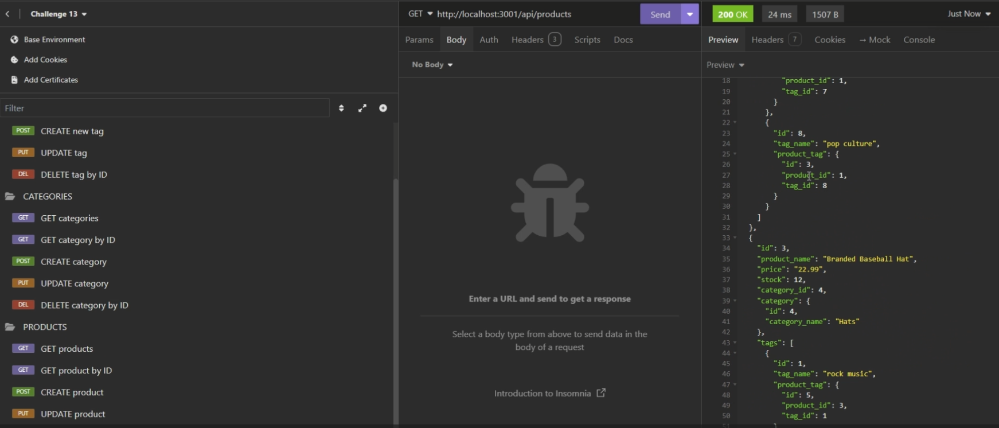

# E-Commerce Back-End

## License
This project is licensed under the [MIT license](https://opensource.org/license/MIT).

## Description
This is a back-end of an internet retail, also known as "e-commerce", site. I took a working Express.js API and configured it to use Sequelize to interact with a PostgreSQL database. See the walkthrough video to see how we are able to create, update, and delete data in the database.

## Table of Contents
- [License](#license)
- [Description](#description)
- [Installation](#installation)
- [Usage](#usage)
- [Contributing](#contributing)
- [Tests](#tests)
- [Questions](#questions)

## Installation
1. Install 
2. Create a PostgreSQL account
3. Navigate to the E-Commerce Back-End repository (https://github.com/nhl1090/E-Commerce-Back-End)
4. Open Bash
5. Navigate to the folder where you would like to clone the repo
6. Use the following command to clone the repo to your local: `git clone https://github.com/nhl1090/E-Commerce-Back-End.git`
7. Use the following command to open the cloned repo in VS Code `code .` to examine the code
8. Enter `npm install` in your terminal to install required dependencies (Sequelize, Express, dotenv)
9. Ensure that your .env file has:
    - DB_USER=your_db_user
    - DB_PASSWORD=your_db_password
    - DB_DATABASE=your_db_name
10. Download 
11. Create a collection in Insomnia
12. Organize folders by TAGS, CATEGORIES, and PRODUCTS,
13. Test your routes (GET, CREATE, UPDATE, DELETE) on your local (http://localhost:3001/your_routes).

## Usage

Video walkthrough is accessible here:
https://drive.google.com/file/d/1h4P0hGuOy-tYQ5jWP9pfuhHcMltHLWE5/view?usp=drive_link

## Contributing
- [The Coding Bootcamp](https://github.com/coding-boot-camp)
    - [Starter Code](https://github.com/coding-boot-camp/bookish-sniffle)

## Questions
For any inquiries, please visit [nhl1090](https://github.com/nhl1090). Thank you!